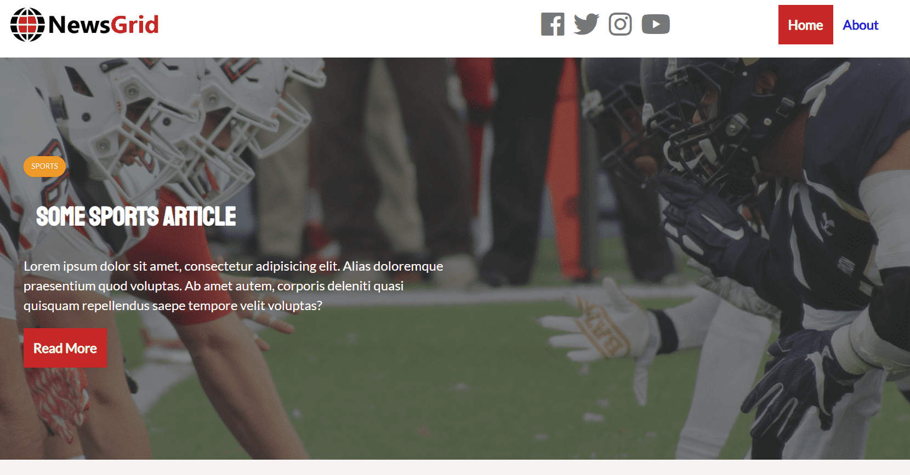

### A few portfolio static resources

There is an example sites that I can create with `HTML5/CSS3/SASS`
You can check out them **[here](https://tender-brown-13edfc.netlify.app/)**

#### [Portfolio site][1]

---
#### [Accountant site][2]

---
#### [Hotel site][3]

---
#### [News site][4]

[1]: https://tender-brown-13edfc.netlify.app/portfolio_site/ "Portfolio site"
[2]: https://tender-brown-13edfc.netlify.app/edge_ledger_site/pages/ "Accountant site"
[3]: https://tender-brown-13edfc.netlify.app/hotel_site/pages/ "Hotel site"
[4]: https://tender-brown-13edfc.netlify.app/news_site/pages/ "News site"